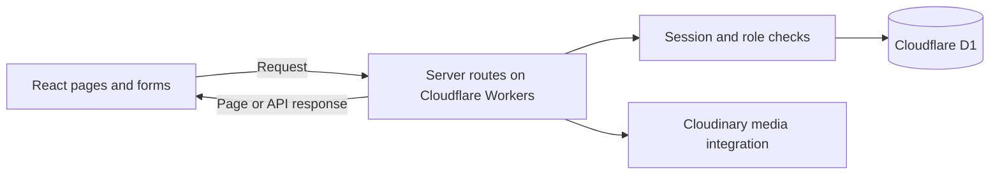
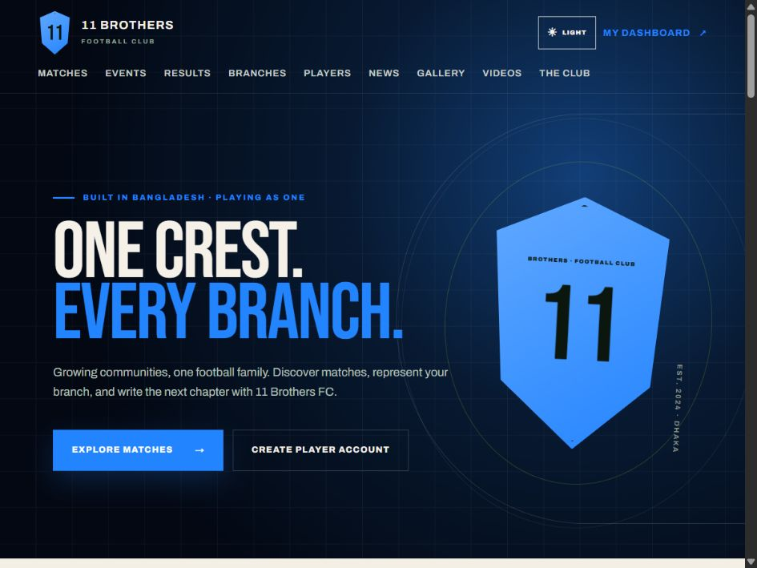
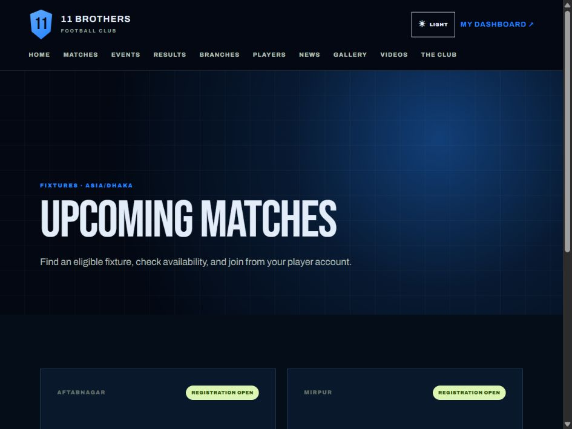
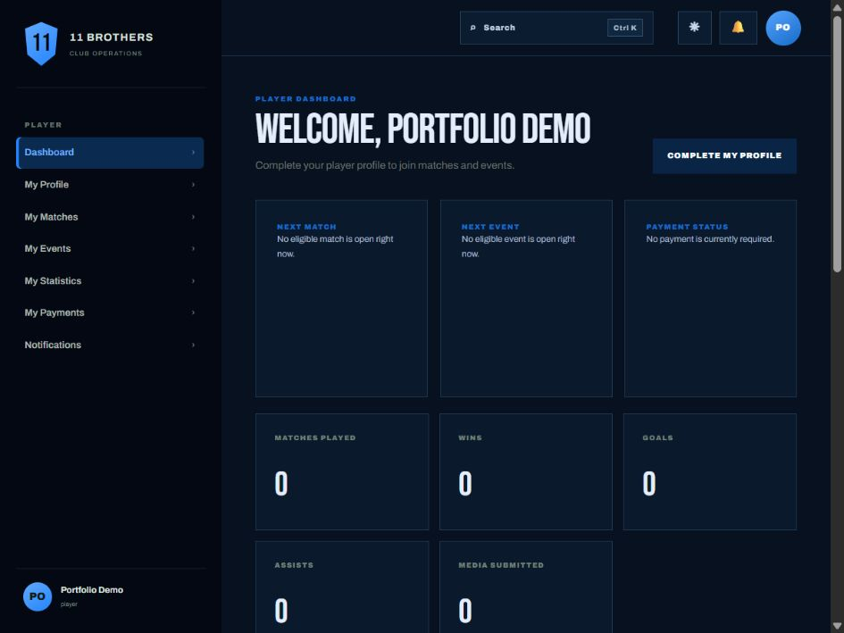
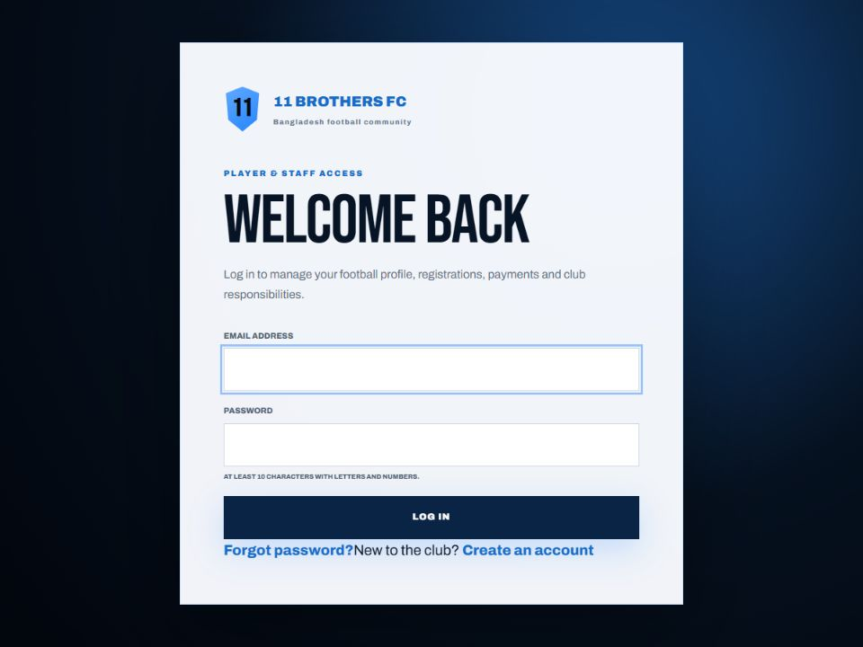

# 11 Brothers FC

My first paid real-world software project, developed for a football organization in Bangladesh.

I built the club platform as an individual project. It brings the public website, player accounts and club administration into one application.

## Key features

- Public pages for branches, players, matches, results, events, news, photos and videos.
- Email/password registration and login, player profiles and a personal dashboard.
- Match and event registration workflows, manual payment submission and staff verification.
- Server-side role checks for club-wide, branch and match responsibilities.
- Administrative pages for club content, players, registrations, payments and reports.
- Notifications and audit records for operational actions.

These features are present in the source. Local validation covered public pages, player registration and the player dashboard; it did not exercise every administrative or external-service workflow.

## Technology

| Layer | Implementation |
| --- | --- |
| Language | TypeScript |
| Interface | React, Vinext / Next-compatible routing, Tailwind CSS |
| Server | Cloudflare Workers and route handlers |
| Database | Cloudflare D1 with Drizzle schema and SQL migrations |
| Files | Cloudinary storage integration |
| Login | PBKDF2 password hashing and database-backed cookie sessions |

This project is written in TypeScript. Python is my main language across my wider portfolio.

## How it works

### The main parts

The React interface contains the public pages, player forms and administration screens. Vinext connects those pages to server route handlers running on Cloudflare Workers. The server uses D1 for structured records and Cloudinary for media. Drizzle describes the database structure, and SQL migrations apply database changes.

### A player registration request

1. A player opens a match or event and submits a registration request.
2. The server reads the login session and checks the rules for the requested operation.
3. If the request is accepted, the application saves the registration in D1 and returns a result.
4. The interface displays the result. Player and staff screens can request the stored registration information later.

### Accounts and staff access

The email/password flow uses salted PBKDF2 password hashes. Login sessions use cookies and database-backed session records. Staff responsibilities are represented by roles and scope, including club-wide, branch and match responsibilities. Server code checks the relevant access before protected operations. The standalone identity fallback needs the hardening described below; this description is not a claim that all authentication paths are production-secure.

### Payments and media

Payment handling includes submission of payment evidence and a separate staff-verification workflow. It is manual review, not an automatic card-payment gateway. Media is handled through Cloudinary integration, while the application stores the information needed to relate media to club content. Private payment evidence is handled separately from public gallery images.

### My contribution

I built this as an individual paid client project, including the interface, server workflows and database integration. The work gives me concrete examples of connecting forms to APIs, organizing relational records and applying role-based rules. Source inspection supports the listed features; the validation section distinguishes what was actually tested from what still needs acceptance testing.

## Screenshots

The following screenshots show the real application running locally with seeded demonstration data and a disposable demonstration account. Counts, names and fixtures shown here are examples, not customer or usage statistics.

## Validation and current limits

The reviewed source passed 12 business-policy tests, TypeScript checking, lint and a production build. The build also passed after the local-preview configuration fixes. Local database migrations and player account creation were then exercised. Cloudinary uploads, payment verification, password-reset email, administrative flows and production persistence require further end-to-end validation.

The standalone authentication integration also needs further hardening before making production-security claims. This case study does not claim a security audit or complete production acceptance.

## Development lessons

The project provides practical examples of relational data modeling, separating public and private data, checking role scope on the server, and keeping local preview data separate from production.

## Future improvements

Expand integration tests for authentication, registration capacity, payment verification and upload privacy; verify restore procedures and deployment acceptance checks.

## Source availability

This repository is a portfolio case study. Client application source, credentials and private records are not included.

## Author

Shanjidul Hasan Rohan · [GitHub](https://github.com/shrohan2003)
